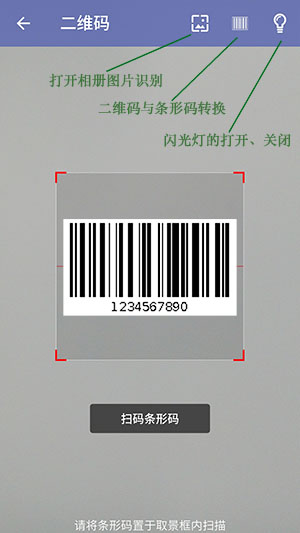

# hy.common.android


* [引入aar的方法](#引入aar的方法)
* [通用开发包 hy.common.android.aar](#通用开发包)
* [二维码开发包 google.zxing.android.aar](#二维码开发包)


引入aar的方法
------
以Android Studio为例

    1. 将hy.common.android.aar拷贝到工程的lib目录中。

    2. 在build.gradle添加repositories节点
```
    android {
        ...
        repositories {
            flatDir {
                dirs 'libs'
            }
        }
    }
    dependencies {
        ...
    }
```

    3. 在build.gradle中的节点添加编译的aar包
```
    dependencies {
        compile(name: 'hy.common.android', ext: 'aar')
        compile(name: 'google.zxing.android', ext: 'aar')
    }
```

    4. 同步更新配置到工程
        [Tools] -> [Android] -> [Sync Project with Gradle Files]


通用开发包
------
[hy.common.android.aar下载](hy.common.android.aar)


二维码开发包
------
[google.zxing.android.aar下载](google.zxing.android.aar) 基本ZXing V3.3.1




Android Studio使用方法如下
--------
1. 参见 [引入aar的方法](#引入aar的方法)

2. AndroidManifest.xml 中添加
```xml
        <activity
            android:name="com.google.zxing.client.android.CaptureActivity"
            android:clearTaskOnLaunch="true"
            android:stateNotNeeded="true"
            android:theme="@style/CaptureTheme"
            android:windowSoftInputMode="stateAlwaysHidden">

            <intent-filter>
                <action android:name="com.google.zxing.client.android.SCAN"/>
                <category android:name="android.intent.category.DEFAULT"/>
            </intent-filter>
            <!-- Allow web apps to launch Barcode Scanner by linking to http://zxing.appspot.com/scan. -->
            <intent-filter>
                <action android:name="android.intent.action.VIEW"/>
                <category android:name="android.intent.category.DEFAULT"/>
                <category android:name="android.intent.category.BROWSABLE"/>
                <data android:scheme="http" android:host="zxing.appspot.com" android:path="/scan"/>
            </intent-filter>
            <!-- We also support a Google Product Search URL. -->
            <intent-filter>
                <action android:name="android.intent.action.VIEW"/>
                <category android:name="android.intent.category.DEFAULT"/>
                <category android:name="android.intent.category.BROWSABLE"/>
                <data android:scheme="http" android:host="www.google.com" android:path="/m/products/scan"/>
            </intent-filter>
            <!-- And the UK version. -->
            <intent-filter>
                <action android:name="android.intent.action.VIEW"/>
                <category android:name="android.intent.category.DEFAULT"/>
                <category android:name="android.intent.category.BROWSABLE"/>
                <data android:scheme="http" android:host="www.google.co.uk" android:path="/m/products/scan"/>
            </intent-filter>
            <!-- Support zxing://scan/?... like iPhone app -->
            <intent-filter>
                <action android:name="android.intent.action.VIEW"/>
                <category android:name="android.intent.category.DEFAULT"/>
                <category android:name="android.intent.category.BROWSABLE"/>
                <data android:scheme="zxing" android:host="scan" android:path="/"/>
            </intent-filter>

        </activity>
```

3. 打开二维码、条形码界面
```java
    /** 二维码标记 */
    private static final int $Result_Scan = 17081;
    
    Intent v_CaptureIntent = new Intent(MainActivity.this ,CaptureActivity.class);
    startActivityForResult(v_CaptureIntent ,$Result_Scan);
```

4. 获取二维码、条形码的信息
```java
    @Override
    protected void onActivityResult(int i_RequestCode, int i_ResultCode, Intent i_Data)
    {
        // 扫描二维码回传
        if ( i_RequestCode == $Result_Scan )
        {
            if ( i_ResultCode == RESULT_OK && i_Data != null )
            {
                // 码信息
                String  v_Content    = i_Data.getStringExtra( CaptureActivity.$Decode_Content_Key);
                // 码类型（ture:二维码  false:条形码）
                boolean v_QRCodeType = i_Data.getBooleanExtra(CaptureActivity.$Decode_QRCodeType ,true);
                
                ...
            }
        }
    }
```